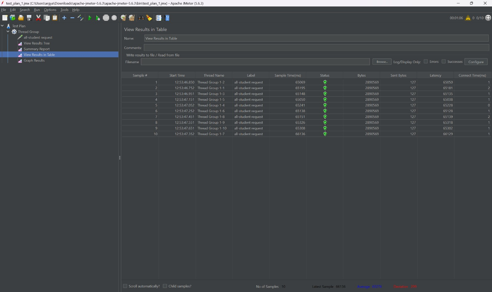

# Pre-Profiling and Optimization Tests

## CLI  Pre-Profiling
1. **/all-student**  
   

2. **/all-student-name**  
   

3. **/highest-gpa**  
   

## GUI  Pre-Profiling
1. **/all-student**  
   

2. **/all-student-name**  
   

3. **/highest-gpa**  
   

---

# Post-Profiling and Optimization Tests

## CLI Post-Profiling
1. **/all-student**  
   

2. **/all-student-name**  
   

3. **/highest-gpa**  
   

## GUI Post-Profiling
1. **/all-student**  
   

2. **/all-student-name**  
   

3. **/highest-gpa**  
   

# Conclusion
After implementing profiling and performance optimizations, a significant improvement was observed across all test cases.
The JMeter results show substantial reductions in execution time:

1. **All Students API**

   Before Profiling: 62,000 - 65,000 ms

   After Profiling: 300 - 700 ms

   Improvement: ~99% reduction in execution time   

2. **All Student Names API**

   Before Profiling: 2,700 - 4,700 ms

   After Profiling: 80 - 378 ms

   Improvement: ~94% reduction in execution time   

3. **Highest GPA API**

   Before Profiling: 70 - 100 ms

   After Profiling: 6 - 33 ms

   Improvement: ~77% reduction in execution time

# Reflection

1. **What is the difference between the approach of performance testing with JMeter and profiling with IntelliJ Profiler in the context of optimizing application performance?**  
   **Answer:** JMeter simulates user load to measure overall system metrics such as throughput and response times, while IntelliJ Profiler dives into the internal workings of the application, providing insights on method execution, CPU, and memory usage to identify specific code inefficiencies.

2. **How does the profiling process help you in identifying and understanding the weak points in your application?**  
   **Answer:** Profiling tracks detailed metrics like method execution times and resource consumption, and visualizes call hierarchies and hotspots, enabling developers to quickly pinpoint inefficient code segments and understand where performance improvements are needed.

3. **Do you think IntelliJ Profiler is effective in assisting you to analyze and identify bottlenecks in your application code?**  
   **Answer:** Yes, IntelliJ Profiler is effective as it integrates seamlessly with the IDE to offer precise insights into CPU and memory usage, making it easier to identify bottlenecks; however, its added overhead means results must be carefully interpreted.

4. **What are the main challenges you face when conducting performance testing and profiling, and how do you overcome these challenges?**  
   **Answer:** Major challenges include creating realistic test scenarios, managing the overhead of profiling tools, and reconciling discrepancies between external load testing and internal profiling. These are addressed by iterative testing, focusing on critical paths, and cross-validating data from multiple tools.

5. **What are the main benefits you gain from using IntelliJ Profiler for profiling your application code?**  
   **Answer:** IntelliJ Profiler offers detailed insights into code execution and resource usage, provides integrated visualizations that simplify bottleneck identification, and accelerates the debugging process by linking performance issues directly to the source code.

6. **How do you handle situations where the results from profiling with IntelliJ Profiler are not entirely consistent with findings from performance testing using JMeter?**  
   **Answer:** I handle inconsistencies by correlating data from both tools through repeated testing under similar conditions, adjusting for the profiler’s overhead, and using the combined insights to form a complete performance picture for more informed optimization decisions.

7. **What strategies do you implement in optimizing application code after analyzing results from performance testing and profiling? How do you ensure the changes you make do not affect the application's functionality?**  
   **Answer:** Optimization strategies include targeted code refactoring, improving database queries and I/O processes, and leveraging asynchronous processing.  

